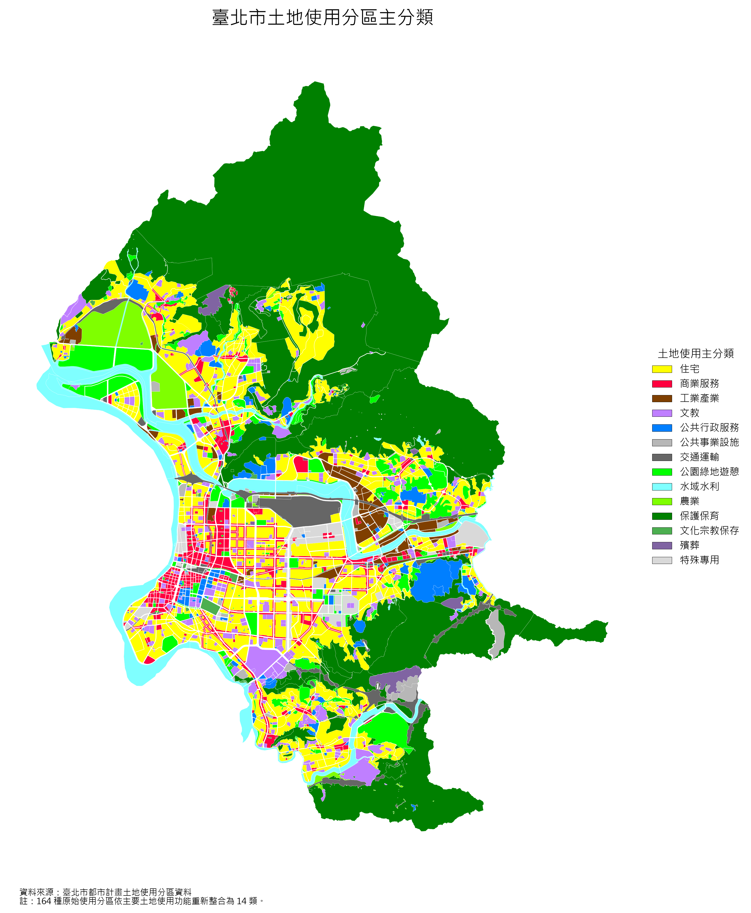
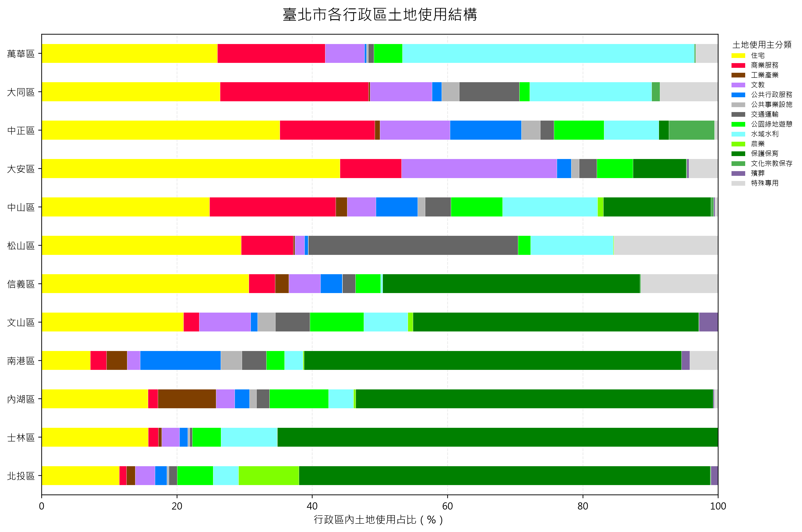
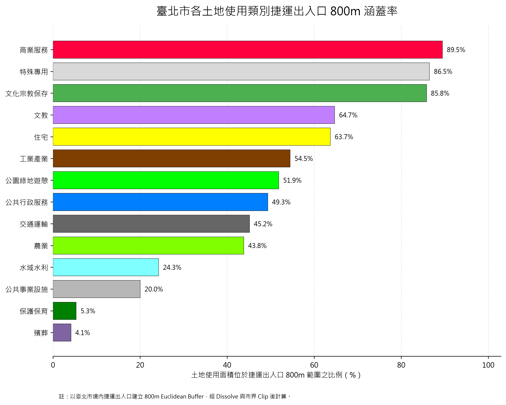

# 臺北市都市土地使用 GIS 分析

## 專案概述

本專案建立一套可重複執行的 GIS 分析流程，用於處理與分析臺北市土地使用分區資料。

專案使用 Python、GeoPandas、Shapely、PostgreSQL/PostGIS 與 Spatial SQL，將原始政府 GIS 圖資轉換為：

- 經過資料品質檢查的空間資料
- 修復後的有效幾何資料
- 重新分類後的分析圖層
- 行政區層級土地使用統計
- 捷運出入口 800 公尺涵蓋分析
- PostGIS 空間資料庫
- 可重複執行的自動化 GIS pipeline

專案重點不僅是完成分析結果，也包含 GIS 工程實務中的：

- CRS 驗證
- Geometry QA
- 空間資料修復
- 屬性清理
- 土地使用分類
- Topology / overlap 檢查
- Spatial Join
- Overlay / Intersection
- Buffer / Dissolve / Clip
- PostGIS Spatial SQL
- GiST Spatial Index
- Pipeline QA
- Logging
- Git / GitHub 版本控制


---

# 主要成果圖

## 臺北市土地使用主分類



原始資料包含 164 種使用分區，本專案重新整理為 14 個分析主分類，同時保留原始土地使用屬性，以維持資料可追溯性。


## 行政區土地使用結構



透過行政區 polygon 與土地使用 polygon 進行 Intersection，計算臺北市 12 個行政區的土地使用組成。


## 捷運出入口 800m 土地使用涵蓋率



以臺北市境內捷運出入口建立 800 公尺 Euclidean Buffer，經過 Dissolve 與臺北市界 Clip 後，再與土地使用主分類進行 Intersection。


---

# 主要分析結果

## 臺北市土地使用結構

Dissolve 後的分析土地使用總面積：

```text
254.179 km²

面積最大的土地使用主分類：
| 主分類    |    面積      |  占比  |
| -------- | ------ ------| -------|
| 保護保育  | 119.951 km² | 47.19% |
| 住宅      |  45.962 km² | 18.08% |
| 水域水利   |  18.104 km² |  7.12% |
| 公園綠地遊憩 | 13.846 km² |  5.45% |
| 文教       |  11.406 km² |  4.49% |
| 商業服務   |  10.066 km² |  3.96% |

行政區土地使用特徵
各行政區主導土地使用範例：
| 行政區 | 主導土地使用 |   占比 |
| ----- | ------------ | ----- |
| 士林區 | 保護保育   | 65.09% |
| 北投區 | 保護保育   | 60.79% |
| 南港區 | 保護保育   | 55.78% |
| 內湖區 | 保護保育   | 52.85% |
| 大安區 | 住宅       | 44.11% |
| 松山區 | 交通運輸   | 30.98% |
| 萬華區 | 水域水利   | 43.15% |

捷運出入口 800m 分析
捷運資料中：全部捷運出入口(587)、臺北市境內捷運出入口(284)
臺北市境內出入口來源：臺北捷運(277)、桃園機場捷運(7)
800公尺 Buffer經Dissolve後: clip前面積(74.403km²)、Clip到臺北市範圍後(91.523km²)
落在捷運出入口800公尺涵蓋範圍內的土鯽使用面積(80.798km²)
整體土地使用涵蓋率：31.79%

各土地使用主分類中，捷運800m涵蓋率最高的類別如下：
| 主分類    | 捷運 800m 涵蓋率 |
| -------- | --------------: |
| 商業服務   |      89.48% |
| 特殊專用   |      86.51% |
| 文化宗教保存 |      85.82% |
| 文教     |      64.72% |
| 住宅     |      63.73% |
| 工業產業   |      54.48% |
本分析使用的是 Euclidean Buffer，代表直線距離涵蓋範圍，不等同實際道路網路步行距離。

[ GIS 分析流程 ]
原始政府 GIS 圖資
        ↓
輸入資料 Schema QA
        ↓
CRS 驗證
        ↓
Geometry Validation
        ↓
Geometry Repair
        ↓
屬性文字清理
        ↓
土地使用重新分類
        ↓
Classification Mapping Join
        ↓
Analytical / Excluded Features 分離
        ↓
Topology / Overlap QA
        ↓
依 Main Category Dissolve
        ↓
面積分析
        ↓
行政區 Intersection
        ↓
行政區土地使用組成分析
        ↓
捷運出入口篩選
        ↓
800m Buffer
        ↓
Buffer Dissolve
        ↓
臺北市界 Clip
        ↓
土地使用 Intersection
        ↓
Coverage Analysis
        ↓
GIS 檔案輸出
        ↓
PostgreSQL / PostGIS
        ↓
Spatial SQL
        ↓
GiST Spatial Index QA
        ↓
自動化 Pipeline + Logging

[ 使用技術 ]
GIS / 空間分析：Python、GeoPandas、Shapely、Pandas、Matplotlib
空間資料庫：PostgreSQL、PostGIS、SQLAlchemy、GeoAlchemy2、psycopg2
開發與版本控制：Jupyter Notebook、Antigravity IDE、pgAdmin、Git、GitHub
主要空間分析CRS：EPSG:3826、TWD97/TM2 zone 121 (此 CRS 為投影座標系統，線性單位為公尺，適合臺北地區的面積與距離分析。)

[ 資料處理與品質檢查 ]
原始土地使用資料：3,840筆features、13個欄位、164種使用分區
原始Geometry類型：Polygon(3,796)、MultiPolygon(44)
Geometry Validation：Valid(3,704)、Invalid(136)、Empty(0)
Invalid geometry比例：3.54%
主要錯誤類型：Hole lies outside shell(74)、Nested shells(43)、Self-intersection(14)、Ring Self-intersection(5)

[ Geometry Repair ]
Invalid Geometry使用："shapely.validation.make_valid()"進行修復，若修復後產生 GeometryCollection，則保留 polygonal components。
最終 Geometry QA：Features(3,840)、Invalid(0)、Empty(0)、Polygon(3,833)、MultiPolygon(7)

[土地使用重新分類]
原始資料共有 164 種使用分區。
原資料中的 顏色 欄位共有 19 種，但經檢查後發現其主要代表圖面與法規符號分類，無法直接作為完整的分析分類。
因此自行建立新的 14 類分析分類，以供後續練習(未按照實際法規與都市計畫分類)：
住宅、商業服務、工業產業、文教、公共行政服務、公共事業設施、交通運輸、公園綠地遊憩、水域水利、農業、保護保育、
文化宗教保存、殯葬、特殊專用
分類結果(164/164)，所有使用分區皆完成分類練習，對於語意較模糊或混合性較高的類別使用："review_required = True"
保留人工檢查標記，而不是直接隱藏分類不確定性。

[ Analytical Dataset ]
原始 3,840 筆資料中，有 8 筆無法作為正式土地使用分析資料。
這些資料包含：規劃範圍 / 細部計畫範圍、無使用分區屬性，但與既有分類 polygon 重疊的 geometry
這些資料未被強制推測分類，而是獨立保留於 QA layer。

最終 analytical layer：3,832 features、0 invalid/empty geometry、0 missing category

[ Topology 與 overlap QA ]
進行landuse self overlap分析後：Candidate overlap pairs(4,607)、實際 overlap > 0.01 m²(1,016)
其中同分類overlap有159組，約0.215km²；跨分類overlap有857組，約0.0031km²
同分類 overlap 會造成面積重複計算，因此正式面積分析前先依 main_category 執行 Dissolve。
跨分類 overlap 面積相對非常小，因此保留並列為資料限制，而不是進行人工拓樸重建。

[ 行政區分析 ]
台北市行政區圖層：12 features、CRS(EPSG:3826)、Geometry(Polygon)、Invalid(0)、Empty(0)
feature-level spatial join結果：輸入土地使用features(3,832)、Left spatial join rows(4,027)、未匹配(4)
4筆未匹配土地使用的點位，距離最近行政區邊界約 3-11公尺，其中包含高速公路、河川、堤坊用地，因此未使用nearest join強制指定行政區

[ 捷運Buffer分析 ]
捷運資料同時包含：車站中心點以及車站出入口
透過表中欄位"MARKNAME1"是否包含"出入口"篩選正確分析點位
分析流程如下：
捷運點位資料
    ↓
出入口篩選
    ↓
臺北市境內 Spatial Filter
    ↓
800m Euclidean Buffer
    ↓
Dissolve overlapping buffers
    ↓
Clip to Taipei City
    ↓
Intersect with dissolved land use
    ↓
Coverage statistics

Buffer執行Dissolve的目的是避免多個捷運站出入口服務範圍重疊時，同一土地使用面積被重複計算。

[ PostgreSQL/PostGIS ]
處理後的GIS圖層匯入 → Database：taipei_gis、Schema：taipei_landuse
主要spatial tables：landuse_analytical、landuse_dissolved、district、mrt_entrances_taipei、mrt_800m_coverage
PostGIS上傳後QA：Polygon(3,825)、MultiPolygon(7)、total(3,832)、SRID(3826)
pipeline執行PostGIS export後，會再自動回查table row count，確認資料庫內容與Python GeoDataFrame一致

[ Spatial SQL ]
PostGIS 用來重現 GeoPandas分析結果
主要使用：ST_Area()、ST_Intersects()、ST_Intersection()
SQL檔案存放於：sql/
目前主要SQL為：01_landuse_area_summary.sql、02_district_landuse_intersection.sql、03_mrt_800m_landuse.sql、
04_mrt_coverage_rate.sql、05_spatial_index_qa.sql
Geopandas與PostGIS分析結果一致

[ Spatial Index 與 Query Performance ]
所有主要 PostGIS geometry 欄位均建立 GiST Spatial Index。
例如：USING GIST (geometry)
使用：EXPLAIN ANALYZE

檢查 Spatial Join 執行計畫。

Execution Plan：
Index Scan using idx_landuse_analytical_geometry
Index Cond: geometry && d.geometry
Filter: ST_Intersects(...)

Execution Time：213.672 ms

PostGIS 回傳：4,023 matched spatial pairs
與 GeoPandas 結果一致：4,023 matched+ 4 unmatched= 4,027 left-join rows

[ 自動化GIS pipeline ]
Notebook 中的重要分析邏輯已拆分為 reusable Python modules：

src/
├─ geometry_utils.py
├─ attribute_utils.py
├─ spatial_analysis.py
├─ pipeline_qa.py
├─ database_utils.py
└─ run_pipeline.py

完整流程可使用：

python src/run_pipeline.py

重新執行。

Pipeline 包含：

Input Schema QA
CRS QA
Geometry Repair
Attribute Cleaning
Classification Mapping
Dissolve
District Analysis
MRT Buffer Analysis
Output Export
Optional PostGIS Upload
PostGIS Row-count QA
Logging
Failure Traceback

[ Logging ]
每次執行 pipeline 會自動建立 timestamp log。

例如：logs/pipeline_20260904_164404.log

Log 內容包含：
各階段執行紀錄
Dataset row counts
QA 結果
Geometry statistics
MRT coverage area
PostGIS upload status
PostGIS verification
Pipeline failure traceback

logs/ 不納入 Git 版本控制。

[ Repository結構 ]
taipei_urban_gis/
├─ data/
│  ├─ raw/                  # Git ignore
│  └─ processed/
│     └─ landuse_mapping.csv
│
├─ outputs/
│  ├─ maps/
│  └─ tables/
│
├─ src/
│  ├─ geometry_utils.py
│  ├─ attribute_utils.py
│  ├─ spatial_analysis.py
│  ├─ pipeline_qa.py
│  ├─ database_utils.py
│  ├─ run_pipeline.py
│  └─ 01_data_audit.ipynb
│
├─ sql/
│  ├─ 01_landuse_area_summary.sql
│  ├─ 02_district_landuse_intersection.sql
│  ├─ 03_mrt_800m_landuse.sql
│  ├─ 04_mrt_coverage_rate.sql
│  └─ 05_spatial_index_qa.sql
│
├─ logs/                    # Git ignore
├─ .gitignore
└─ README.md

[ 主要決策 ]

本專案的重要 GIS Engineering decisions 包含：

1. Spatial analysis 前先修復 invalid geometry
2. 不因 geometry duplicate 就直接刪除 feature
3. Pipeline 開始前驗證 input schema
4. Pipeline 開始前驗證 CRS
5. 保留原始法定土地使用欄位
6. 對模糊分類保留 review flag
7. 不對缺失土地使用屬性的 feature 強制推測分類
8. 正式面積統計前 Dissolve 同分類 overlap
9. 所有 geometry-changing operation 後重新計算面積
10. MRT Buffer 在 Intersection 前先 Dissolve
11. nearest district 不直接視為行政區歸屬
12. Database credential 透過 .env 與程式碼分離
13. PostGIS 上傳後自動回查資料筆數
14. GeoPandas 與 PostGIS 結果進行 cross-validation
15. 使用 EXPLAIN ANALYZE 驗證 GiST spatial index
16. Pipeline 執行過程保留 timestamp logging

[ 研究限制 ]
本專案將原始 164 種法定土地使用分區簡化為 14 個分析主分類，因此不得取代正式都市計畫法定使用分區。
部分 invalid geometry 經 make_valid() 修復後可能產生空間結構變化，尤其是 Nested Shells 類型。

分析資料中仍存在約：0.0031 km² 跨分類 overlap。

4 筆土地使用 feature 因不同資料來源的行政邊界差異，未與臺北市行政區 polygon 相交。

捷運 800m 分析為 Euclidean distance，不代表實際步行道路網路距離。


[ 後續可進一步發展 ]

將檔案路徑與分析參數改為 configuration-driven
將圖表與地圖輸出納入 automated pipeline
增加 unit tests / integration tests
使用道路 network 建立實際步行 service area
改善 PostGIS database management
建立 GitHub Actions 自動 QA
完成求職作品集簡報

[ 長期目標 ]

讓未來新的臺北市土地使用資料，只需更換 input dataset，就能自動重新執行 QA、分類、空間分析、PostGIS 載入與成果輸出。
